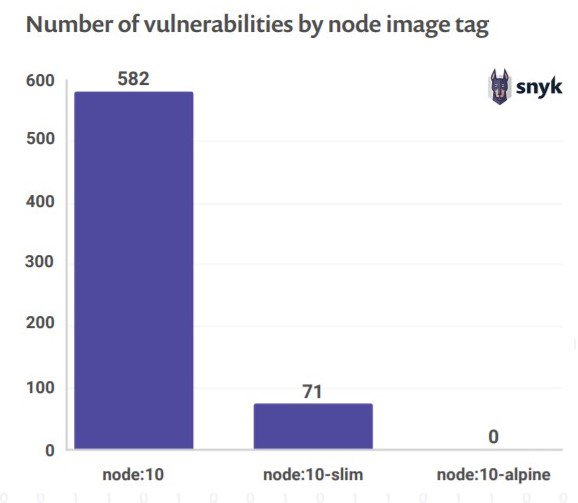
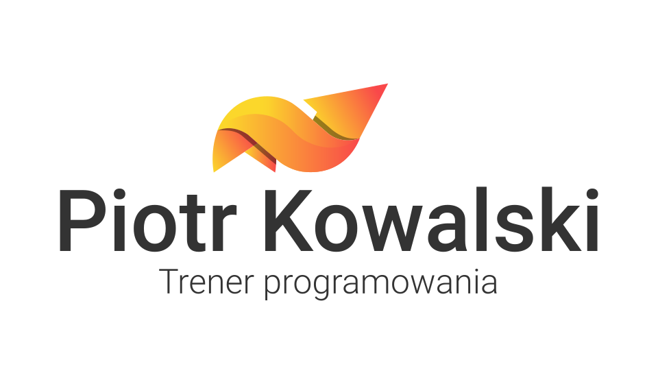

class: middle, slide-invert-colors

.size60[

# Jak uruchomić aplikację <mark>Angularową</mark> z <var>SSR</var><br/>korzystając z _Dockera_?

]


---

class: middle, slide-background-purple

# Aplikacje webowe

---

class: slide-background-purple

### Aplikacje webowe

.size40[

* Jak boty indeksują strony?
* Co to jest SSR?
* Dlaczego Angular?

]

---

class: middle, slide-background-blue

# Docker

---

class: slide-background-blue

### Docker

.size40[

* Co to jest Docker?
* Po co jest Tobie potrzebny?
* Skąd pobierać obrazy?
* "overlay2"

]

---

class: slide-background-blue

### Docker — Alpine

.size40[

* Waży 6MB
* Przeznaczenie
* Uratował [hub.docker.com](https://hub.docker.com)
* Jest bezpieczny?

]

---

class: center, slide-background-blue



Źródło: <https://twitter.com/KarkochaTech/status/1110542478342537218>

---

background-image: url(images/docker-containers-vs-vms.png)

### Kontener to nie maszyna wirtualna

.box.right[

<ul style="padding: 0; margin: 0">
    <li>nie ma Hypervisora, np. VirtualBox</li>
    <li>nie ma managera pamięci</li>
    <li>namespace linuxowy (pid, net, users)</li>
</ul>

]

<br/><br/><br/><br/><br/><br/><br/><br/><br/><br/><br/>

&nbsp;&nbsp;&nbsp;&nbsp;&nbsp;&nbsp;&nbsp;&nbsp;&nbsp;&nbsp;&nbsp;
Źródło: <https://blog.netapp.com/blogs/containers-vs-vms/>

???

* Namespace linuxowy
    + ma swój pid — nie widać na kontenerze procesów hosta
    + ma swoje wirtualne interfejsy sieciowy i tablicę routingu
    + ma własną definicję użytkowników i grup

---

class: middle, slide-background-blue

# <u>Możemy</u> uruchamiać bazę danych w <u>kontenerze</u> Dockerowym

---

class: middle, slide-background-blue, size40

```dockerfile
version: "3"

services:
  database:
    image: mongo:4.1.9
    ports:
      - 27017:27017
    volumes:
      - /my-project/data/:/data/db/
```

---

class: slide-background-brown

### Etap 0: Stworzenie aplikacji Angularowej

* Wygenerować aplikację za pomocą CLI

    ```bash
    npm i -g @angular/cli
    ng new personal-page --routing
    ```

* Dodać routing

    ```bash
    ng g c pages/home-page
    ng g c pages/contact-page
    # update router routes
    # add menu
    ```

---

class: slide-background-brown

### Etap 1: Uruchomienie z użyciem Dockera

1. Stworzyć pliki konfiguracyjne
    + `Dockerfile`
        - `npm install`
        - `npm ci`
    + `.dockerignore`
        - `node_modules/`
        - `.git/`
    + `docker-compose.yaml`
2. Uruchomić: `docker-compose up`

---

class: slide-background-brown

### Docker a Development

.size30[

* Mapowanie portów <ins>(aby uruchomić aplikację w przeglądarce)</ins>

    ```text
    ports:
      - 4200:4200
    ```

* Mapowanie katalogów <ins>(aby zmieniać pliki bez budowania na nowo)</ins>

    ```text
    volumes:
        - ./:/app/
    ```

]

---

class: slide-background-brown

### Etap 2: Wsparcie <mark>Server-side renderingu</mark>

.size30[

Oficjalne 👎

<https://github.com/angular/angular-cli/wiki/stories-universal-rendering>

Nieoficjalne 👍

<https://otcollect.com/collection/angular/page/e45NbG8W/how-to-add-universal-ssr-to-your-angular-cli-and-firebase-angularfire2-project>

]

---

class: slide-background-brown

### Etap 2: Step by step

.size25[

```bash
# Dodanie odpowiednich części aplikacji
ng generate universal --client-project test-docker-angular

### Dodatkowo trzeba stworzyć "server.ts"
### oraz "webpack.server.config.js"

# Zbudowanie aplikacji
npm run build && npm run serve:ssr

# Serwowanie za pomocą Express.js
npm run serve:ssr
```

]

---

class: slide-background-blue

### Etap 3. Przygotowanie do publikacji

.size40[

* Wygenerowany `dist/` w obrazie
    + Dlaczego?
    + Proces uruchamiania aplikacji musi być szybki
* Usunąć współdzielenie katalogu

]

---

class: middle, slide-invert-colors

# Demo 🎉

<https://github.com/piecioshka/test-docker-angular>

---

class: middle, slide-background-red

# Jaka jest różnica między <u>Deployem</u> a <u>Releasem</u>?

---

exclude: true

### Z czego się uczyłem?

* [x] <https://www.youtube.com/watch?v=khL05aQAWDU>
    + pl, prelekcja Kamila Grabowskiego
* [x] <https://scotch.io/tutorials/create-a-mean-app-with-angular-2-and-docker-compose>
    + en, przyjemny tutorial jak uruchomić MEAN na Docker
* [x] <https://wiki.alpinelinux.org/wiki/Comparison_with_other_distros>
    + en, porównanie dystrybucji
* [x] <https://nodejs.org/en/docs/guides/nodejs-docker-webapp/>
    + en, manual

---

class: middle, no-display-my-logo

.text-center[

# <samp>Dziękuję!</samp>

]

.box.left.size30.list-unstyled.middle-images.line-height-2x[

*  [@piecioshka](https://github.com/piecioshka)
*  [@piecioshka](https://twitter.com/piecioshka)
*  [@piecioshka](https://youtube.com/piecioshka)
*  [@piecioshka](https://linkedin.com/in/piecioshka)
*  [@piecioshka.trener](https://fb.com/piecioshka.trener)

]

.box.right[



]